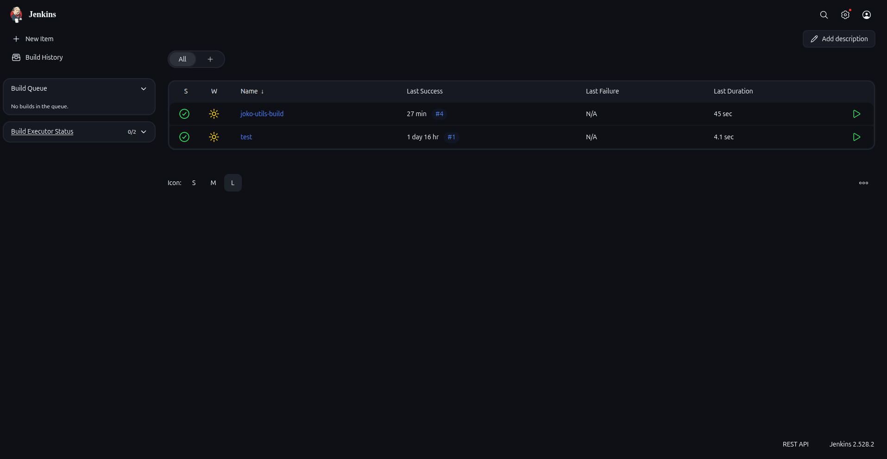
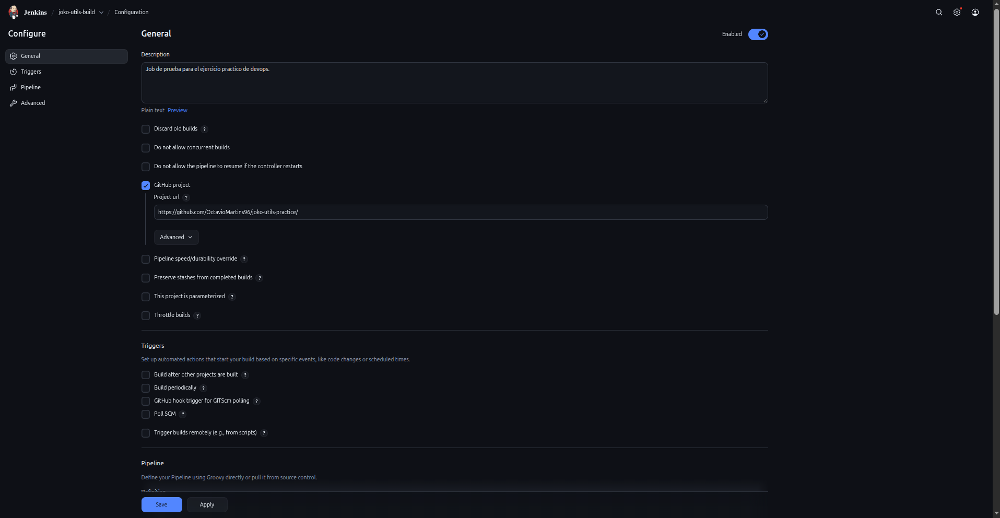
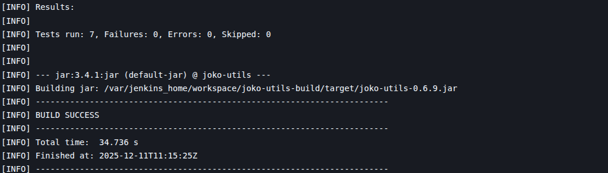

# 3.1. Preparación del entorno con SDKMAN!

### ¿Que es SDKMAN!?

Es una herramienta de linea de comandos (CLI) que permite **instalar, cambiar y gestionar** múltiples versiones de Kits de Desarrollo de Software (SDKs) en sistemas operativos basados en Unix. Siendo un **gestor de versiones** para herramientas que usan lenguajes como **java, kotlin, scala** y herramientas de build como **Maven o Gradle**.

## ¿Para qué se utiliza en entornos Java/DevOps?

Para **gestionar** múltiples versiones de SDKs y build tools de forma mas practica, rapida y no invasiva. Garantizando la **compatibilidad y consistencia** del entorno de desarrollo a lo largo del ciclo de vida del software.


## Instalar SDKMAN!
Para instalar SDKMAN! se requiere la utilidad **zip y unzip** primeramente, por lo cual la puedes instalar con el siguiente comando:

```bash
sudo apt install unzip zip
```

Luego ejecuta para instalarlo:

```bash
curl -s "https://get.sdkman.io" | bash
```

Ejecutar el siguiente comando para no tener que abrir una nueva terminal:

```bash
source "~/.sdkman/bin/sdkman-init.sh"
```

Para listar las opciones de java disponibles:

```bash
sdk list java
```

Instalacion de una version LTS:

```bash
sdk install java 17.0.17-tem
```

Poner la versión como defecto:

```bash
sdk default java 17.0.17-tem
```

Verificar que el sistema utilize la version configurada con SDKMAN con el siguiente comando:

```bash
java --version && javac --version
```

# 3.2. Maven

Instalar maven con el gestor de paquetes de ubuntu:

```bash
sudo apt install maven
```

Una vez instalado, verificar la version de maven instalada con el siguiente comando:

```bash
mvn --version
```

En la misma salida de maven, verificar que este utilizando la version de maven previamente instalada:


# 3.3. Obtención y exploración del proyecto joko-utils

Instalar primeramente git si no esta instalado:

```bash
sudo apt install git
```

Clonar el repositorio correspondiente:

```bash
git clone https://github.com/jokoframework/joko-utils.git
```

### Ubicación del archivo pom.xml

El arhivo se encuentra en la raiz del proyecto: `/joko-utils/pom.xml`

### Estructura de los directorios principales

- /src/main/java
- /src/test/java
- pom.xml
- /target/

### Referencia a CI

El archivo maven.yml, ubicado en el directorio: `/joko-utils/.github/workflows` hace referencia a procesos y configuraciones de CI.

# 3.4. Fases de maven

### 1 - clean (Limpiar el proyecto)

Elimina todos los archivos generados por la build anterior (ejemplo el directorio /target). Asegurando que la construccion sea limpia.

```bash
mvn clean
```
**Resultado**: Build Success


### 2 - validate (Validar el codigo): 

Verifica si el proyecto esta correcto y verifica si toda la informacion esta disponible.

```bash
mvn validate
```

**Resultado**: Build Success


### 3 - compile (Compilar el codigo): 

Traduce el codigo fuente a bytecode (El comando ejecuta primeramente **validate**, verificando que este correcto)

```bash
mvn compile
```

**Resultado**: Build Success


### 4 - test (Ejecutar los test):

Realiza pruebas del codigo compilado. Depende de la fase de compile (y lo ejecuta si no se ha hecho antes). El resultado incluye un resumen de cuantos test se ejecutaron y si alguno fallo.

```bash
mvn test
```

**Resultado**: Build Success

**Test realizados**: 7


### 5 - package (Generar el artefacto empaquetado):

Toma los archivos compilados y los empaqueta en el formato de distribucion final (generalmente un .jar o .war). Depende de las fases de **validate, compile y test**, y las ejecuta en orden.

```bash
mvn package
```

**Resultado**: Build Success

**Ubicacion del artefacto**: /home/devops/joko-utils/target/joko-utils-0.6.9.jar

**Nombre del artefacto**: joko-utils-0.6.9.jar


## Consejo practico

Para ejecutar todas las fases hasta package se puede utilizar el siguiente comando (intentar probar a futuro):

```bash
mvn clean package
```

El cual ejecuta el **clean** y luego **validate, compile, test** y finalmente **package**.

## 3.5: Script

El resultado de la ejecucion del script fue exitosa:


## 3.6: Cambio mínimo en el codigo 

El archivo modificado fue: `~/joko-utils/src/main/java/io/github/jokoframework/utils/date/DateTimeUtils.java`, especificamente la funcion: `dateFromHourMinSec`

Mensaje original:

```bash
throw new IllegalArgumentException(hhmmss + " is not a valid time, expecting HH:MM:SS format");
```

Mensaje modificado:

```bash
throw new IllegalArgumentException("joko-utils v2.0: Invalid time format [" + hhmmss + "]. Expected format is HH:MM:SS.");
```

Se realizo nuevamente la ejecucion del script, el cual termino con un resultado exitoso.


No hubo impacto en la ejecucion de los tests.

## 3.7. Reflexión DevOps

### ¿Por qué es útil gestionar múltiples versiones de Java con una herramienta como SDKMAN! en un contexto DevOps?

Es util porque ademas de simplificar la gestion de versiones, permite poder cambiar de forma segura y rapida versiones de java (e incluso de distintos proveedores), lo cual beneficia al momento a tener distintos proyectos, los cuales utilizan diferentes versiones de java entre si.

### ¿Qué ventajas y desventajas ves en utilizar Maven desde el repositorio de Ubuntu frente a otras formas de instalación?

Entre las ventajas del mismo:

- Es mas facil y rapido instalar, ya que solo se requiere un comando: `apt install maven`

- El sistema se encarga de la **configuracion del path y dependencias**.

- **Las actualizaciones y parches de seguridad** se manejan con el resto del sistema.

Pero tambien cuenta con ciertas desventajas:

- Es mucho mas complicado tener multiples versiones de **maven** instaladas simultaneamente para distintos proyectos.

- Los repositorios de Ubuntu priorizan la estabilidad, por lo cual las versiones de maven disponible a traves de `apt` suele ser **varias veces menor** a la última version estable oficial.

## ¿Qué pasos de este ejercicio se asemejan a un pipeline de CI real en Jenkins o GitHub Actions?

La parte de realizar el script.sh se asemeja a un pipeline de CI real de Jenkins, debido a que hay que automatizar el build lifecycle de maven.

## ¿En qué etapa del proceso se detectarían fallos de compilación o tests que impedirían desplegar a un entorno productivo?

Estos fallos se detectarian al hacer los comandos de `mvn compile` o `mvn test`, ya que verifican que se haya construido correctamente y que hayan pasado los test unitarios correspondientes

Fuentes: 
- https://sdkman.io/ (Ques es SDKMAN, para que sirve y comando de instalacion)
- https://www.markdownguide.org/basic-syntax/ (Sintaxis del markdown)
- https://maven.apache.org/guides/introduction/introduction-to-the-lifecycle.html (Ciclo de vida de maven)
- https://bertvv.github.io/cheat-sheets/Bash.html (Tips para bash)
- https://www.youtube.com/watch?v=bBqxC43ASsM (Maven)
- https://docs.github.com/en/pull-requests/collaborating-with-pull-requests/working-with-forks/fork-a-repo (Como realizar un fork)


# Ejercicio Práctico - DevOps - 002

## 3.1 Instalación y configuración de Docker engine

Para realizar la instalacion de docker, primeramente de debe de desinstalar los paquetes/dependencias que podrian generar conflicto.

```bash
sudo apt remove $(dpkg --get-selections docker.io docker-compose docker-compose-v2 docker-doc podman-docker containerd runc | cut -f1)
```

### Instalacion usando el repositorio APT

Configurar el repositorio apt:

```bash
# Añadir la llave GPG oficial de Docker:
sudo apt update
sudo apt install ca-certificates curl
sudo install -m 0755 -d /etc/apt/keyrings
sudo curl -fsSL https://download.docker.com/linux/ubuntu/gpg -o /etc/apt/keyrings/docker.asc
sudo chmod a+r /etc/apt/keyrings/docker.asc

# Añadir el repositorio a las fuentes del APT:
sudo tee /etc/apt/sources.list.d/docker.sources <<EOF
Types: deb
URIs: https://download.docker.com/linux/ubuntu
Suites: $(. /etc/os-release && echo "${UBUNTU_CODENAME:-$VERSION_CODENAME}")
Components: stable
Signed-By: /etc/apt/keyrings/docker.asc
EOF

sudo apt update
```

Instalar los paquetes de Docker:

```bash
sudo apt install docker-ce docker-ce-cli containerd.io docker-buildx-plugin docker-compose-plugin
```

Para verificar si Docker esta corriendo:

```bash
sudo systemctl status docker
```

Probar que la instalación sea exitosa corriendo la imagen **"hello-world"**:

```bash
sudo docker run hello-world
```

### Administrar Docker como usuario no root:

Crear el grupo `docker`:

```bash
sudo groupadd docker
```

Añadir el/nuestro usuario al grupo `docker`:

```bash
sudo usermod -aG docker $USER
```

Ejecutar el siguiente comando para activar los cambios del grupo:

```bash
newgrp docker
```

Verificar correr comando de `docker` sin `sudo`:

```bash
docker run hello-world
```

### Salida del comando `docker version`:

```text
Client: Docker Engine - Community
 Version:           29.1.2
 API version:       1.52
 Go version:        go1.25.5
 Git commit:        890dcca
 Built:             Tue Dec  2 21:55:07 2025
 OS/Arch:           linux/amd64
 Context:           default

Server: Docker Engine - Community
 Engine:
  Version:          29.1.2
  API version:      1.52 (minimum version 1.44)
  Go version:       go1.25.5
  Git commit:       de45c2a
  Built:            Tue Dec  2 21:55:07 2025
  OS/Arch:          linux/amd64
  Experimental:     false
 containerd:
  Version:          v2.2.0
  GitCommit:        1c4457e00facac03ce1d75f7b6777a7a851e5c41
 runc:
  Version:          1.3.4
  GitCommit:        v1.3.4-0-gd6d73eb8
 docker-init:
  Version:          0.19.0
  GitCommit:        de40ad0
```

## 3.2 Despliegue de Jenkins en docker

En docker hub, la imagen oficial LTS de [jenkins](https://hub.docker.com/r/jenkins/jenkins) seria la `jenkins/jenkins:lts-jdk17`.

Comando para iniciar el contenedor:

```bash
docker run -d \
--name jenkins-lts \
-p 8080:8080 \
-v jenkins_data:/var/jenkins_home \
--restart unless-stopped \
jenkins/jenkins:lts-jdk17
```

Donde:

- -d = Inicia el contenedor en segundo plano y libera la terminal (detached).
- --name = Asigna un nombre al contenedor.
- -p = Mapea un puerto del host al puerto del contenedor, `<host>:<contenedor>`.
- -v = Crea y monta un volumen con el nombre asignado, mapeado al volumen interno dentro del contenedor `<volumen_host>:<volumen_del_contenedor>`.
- --restart unless-stopped: Reinicia el contenedor a menos que lo detengas explicitamente con `docker stop`. Esto asegura que el contenedor **sobreviva al reinicio del servidor host**.

Una vez ejecutado el comando, verificar que el contenedor esta activo con:

```bash
docker ps
```

Salida del comando:


## 3.3 Configuracion inicial del jenkins.

Se pudo acceder correctamente al jenkins y a su dashboard:



## 3.4 Configuración de Herramientas (Global tool configuration)

Jenkins no puede ver el java instalado en la maquina host, debibo que al ser instalado como contenedor, es un entorno completamente aislado del sistema, por lo cual debe de instalarse nuevamente el java dentro del mismo, para que este pueda trabajar por los jobs dentro del contenedor.

## 3.5 Creacion del Job "joko-utils-build"

La configuración del job seria:



Se opto por la realizacion del pipeline, el cual seria el siguiente:

```pipeline
pipeline {
    agent any
    
    tools {
        maven 'maven-3.9.9'
        jdk 'java-17-tem'
    }
    
    stages {
        stage ('Checkout Source') {
            steps {
                sh 'echo "Clonando Repositorio"'
                git url: 'https://github.com/OctavioMartins96/joko-utils-practice/', branch: 'testing'
            }
        }
        stage ('Build with maven') {
            steps {
                sh 'echo "Construyendo el paquete"'
                sh 'mvn clean package'
            }
        }
    }
    
    post {
        success {
            echo 'Construccion Exitosa'
        }
        failure {
            echo 'Construccion Fallida'
        }
    }
}
```

## 3.6 Ejecucion y verificación del job

Una vez ejecutado el job, el resultado fue exitoso:



El archivo jar generado se encuentra en: `/var/jenkins_home/workspace/joko-utils-build/target/joko-utils-0.6.9.jar`

## 3.7 Reflexión DevOps II

### ¿Cuál es la ventaja de correr Jenkins en Docker en lugar de instalarlo nativamente en el servidor?

La ventaja de correr Jenkins como docker es que permite que el servicio mismo sea mucho mas escalable, ya que al estar dockerizado, puede ejecutarse en cualquier entorno el cual tenga docker, ademas de contar con un despliegue mas rapido y al estar aislado, sus dependencias no genera conflicots con otros servicios en el host y viceversa.

### ¿Qué es un Volumen en Docker y qué pasaría con tu configuración de Jenkins si no lo hubieras usado al apagar el contenedor?

Un volumen en docker es un almacenamiento que permite persistir los datos generados fuera del contenedor.

Lo que hubiera pasado con la configuracion de Jenkins al momento de apagar el contenedor, es que se habria perdido, debido a la naturaleza temporal y efimera de los contenedores docker.

### En el ejercicio 1 ejecutaste los tests manualmente o por script. ¿Qué valor aporta Jenkins al ejecutar estos tests automáticamente cada vez que se hace un cambio?

Aporta bastante, debido a que al poder ejecutar de forma automatica al recibir cambios, se evita el error humano y te de un retorno de si se pudo construir correctamente, siendo todo este proceso automatico y formando parte importante del CI/CD.

Tambien elimina la necesidad de que los desarrolladores interrumpan su trabajo para ejecutar los test manualmente y cuenta tambien con un **quality gate**, debido a que jenkins tambien actua como un filtro, permitiendo solo que el codigo que haya pasado exitosamente los teste y otros chequeos, avance a las siguientes etapas del pipeline.


Fuentes: 
- [Instalación de Docker engine](https://docs.docker.com/engine/install/ubuntu/)
- [Imagen de Jenkins en docker](https://hub.docker.com/r/jenkins/jenkins)
- [Sintaxis de opciones en docker](https://docs.docker.com/reference/cli/docker/container/run/)
- [Ejemplo de pipeline en Jenkins](https://www.jenkins.io/doc/pipeline/examples/)

# Ejercicio DevOps-003

## 6.1 **Configuración de Ansible en el Jenkins Master**

Para disponer de **Ansible instalado** dentro del contenedor de Jenkins, se procede a crear un **Dockerfile**:

```Dockerfile
FROM jenkins/jenkins:lts-jdk17

USER root

RUN apt-get update && \
    apt-get install -y \
    --no-install-recommends \
    ansible

USER jenkins
```

Se construye la imagen:

```bash
docker build -t "jenkins-ansible:v1" .
```

Luego, se detiene y elimina el contenedor anterior:

```bash
docker stop jenkins
docker rm jenkins
```

A continuación, se crea un nuevo contenedor basado en la imagen:

```bash
docker run -d \
-v jenkins_data:/var/jenkins_home \
-p 8080:8080 \
--restart unless-stopped \
--name jenkins-ansible \
jenkins-ansible:v1
```

Para ingresar al contenedor:

```bash
docker exec -it jenkins-ansible bash
```

Y verificar la instalación de Ansible:

```bash
ansible --version
```

La salida debería ser similar a:

```bash
ansible [core 2.19.4]
  config file = None
  configured module search path = ['/var/jenkins_home/.ansible/plugins/modules', '/usr/share/ansible/plugins/modules']
  ansible python module location = /usr/lib/python3/dist-packages/ansible
  ansible collection location = /var/jenkins_home/.ansible/collections:/usr/share/ansible/collections
  executable location = /usr/bin/ansible
  python version = 3.13.5 (main, Jun 25 2025, 18:55:22) [GCC 14.2.0] (/usr/bin/python3)
  jinja version = 3.1.6
  pyyaml version = 6.0.2 (with libyaml v0.2.5)
```

Dentro de Jenkins, instalar el plugin **Ansible** e ir a `Tools` → `Ansible installations` para especificar el directorio del ejecutable: `/usr/bin`.

---
## 6.2 **Configuración de autenticación SSH por claves.**

En la VM se debe generar un par de claves SSH:

```bash
ssh-keygen -t ed25519 -C "jenkins"
```

Se obtiene la clave privada:

```bash
cat .ssh/id_ed25519
```

Luego, la clave se agrega en Jenkins: `Manage Jenkins → Credentials → Global → Add Credentials`.  
Se recomienda instalar el plugin **SSH Agent** para integrarlo fácilmente en los pipelines.

Finalmente, la clave pública generada se agrega en el servidor **target** para permitir la autenticación sin contraseña

### 6.3 **Contenido completo del inventario Ansible.**

Para organizar la configuración y archivos de Ansible, se crea una carpeta **ansible** dentro del repositorio. Allí se crea el archivo **ansible.cfg** con el siguiente contenido:

```cfg
[defaults]
inventory = hosts.yml
host_key_checking = False
```

Donde:

- **inventory**: Indica dónde está el inventario de hosts que Ansible va a utilzar.
- **host_key_checking = False**: Desactiva la verificación de la clave SSH del host.

Luego se crea el inventario **hosts.yml**:

```yml
all:
  children:
    app_servers:
      hosts:
        target-vm:
          ansible_host: 192.168.122.53
          ansible_user: dev
          ansible_become: yes
          ansible_become_method: sudo
          ansible_become_password: "{{ VM_PASS }}"
```

Donde:

- **all**: grupo raíz que contiene todos los hosts del inventario.
- **children**: permite definir subgrupos dentro de **all**, útil para organizar por función o entorno.
- **app_servers**: grupo de hosts que comparten la misma función.
- **hosts**: lista de hosts específicos dentro del grupo.
- **target-vm**: nombre lógico del host en Ansible.
- **ansible_host**: IP o hostname real del host.
- **ansible_user**: usuario con el que Ansible se conectará vía SSH.
- **ansible_become**: habilita privilegios elevados (sudo).
- **ansible_become_method**: método para elevar privilegios.
- **ansible_become_password**: contraseña del sudo, que se pasará como variable desde Jenkins.

---

## 6.4 **Contenido completo del playbook de despliegue**

Se crea **deploy.yml** con el siguiente contenido:

```yml
---
- name: Java app deploy
  hosts: app_servers
  become: yes
  
  vars:
    target_path: "/opt/joko-utils"
    jenkins_workspace: ""
    jar_name: ""
  
  tasks:
    - name: Confirm that Java is installed (Ubuntu)
      apt:
        name: openjdk-17-jdk-headless
        state: present
        update_cache: yes
    
    - name: Create the directory for the application
      file:
        path: "{{ target_path }}"
        state: directory
        owner: dev
        group: dev
        mode: '0755'
    
    - name: Copy the .jar file to the target VM
      copy:
        src: "{{ jenkins_workspace }}/target/{{ jar_name }}"
        dest: "{{ target_path }}/{{ jar_name }}"
        owner: dev
        group: dev
        mode: '0644'
    
    - name: Create the systemd file
      template:
        src: templates/joko-utils.j2
        dest: /etc/systemd/system/joko-utils.service
      notify: Restart app
    
    - name: Ensure that the service is active and enabled
      systemd:
        name: joko-utils
        state: started
        enabled: yes
        daemon_reload: yes
  
  handlers:
    - name: Restart app
      systemd:
        name: joko-utils
        state: restarted
```

**Explicación:**

- **become: yes**: ejecuta las tareas con privilegios de root usando sudo.
- **vars**: valores reutilizables dentro del playbook.
- **tasks**: acciones a ejecutar en los hosts.
- **handlers**: tareas que se ejecutan solo si son notificadas por un task (ej. reinicio de servicio).

Los módulos utilizados:

- **apt**: gestiona paquetes en Ubuntu/Debian.
- **file**: asegura la existencia y permisos de un directorio.
- **copy**: copia archivos desde el workspace de Jenkins al servidor.
- **template**: crea archivos a partir de plantillas Jinja2.
- **systemd**: controla servicios del sistema Linux.

---
## 6.5 Archivo de servicio systemd (.j2)

El archivo .j2 para el systemd seria el siguiente:

```j2
[Unit]
Description=Joko Utils Service
After=network.target

[Service]
User=dev
WorkingDirectory={{ target_path }}
ExecStart=/usr/bin/java -jar {{ target_path }}/{{ jar_name }}
Type=oneshot
RemainAfterExit=yes
Restart=no

[Install]
WantedBy=multi-user.target
```

Donde:

- **Description**: Es el nombre descriptivo del servicio.
- **After**: Indica que este servicio debe iniciarse después de que la red este disponible.
- **User**: El servicio se ejecuta como el usuario dev, no como root por seguridad.
- **WorkingDirectory**: Especifica el directorio donde se ejecutara el servicio.
- **ExecStart**: Especifica el comando para iniciar la aplicación de java
- **Type**: Especificamos que es un proceso que termina solo.
- **RemainAfterExit**: Mantiene el servicio **activo** anque el proceso haya terminado, en este proceso nada mas para prueba.
- **Restart**: Evita reiniciso automaticos innecesarios.
- **WantedBy**: Indica que el servicio debe iniciarse automáticamente cuando el sistema arranca en modo multi-usuario, esto permite que el servicio se habilite con `systemctl enable joko-utils`.
---

## 6.6 Integración de ansible con Jenkins

Se añade la fase de despliegue en el pipeline de Jenkins después de generar los artefactos con Maven:

```jenkinsfile
stage ('Deploy with Ansible') {
    steps {
        script {
            def jarName = sh(
                script: "find target/ -maxdepth 1 -type f -name 'joko-utils-*.jar' | sort | tail -n 1 | xargs basename",
                returnStdout: true
            ).trim()
            
            sshagent(['jenkins-ssh']) {
                withCredentials([usernamePassword(credentialsId: 'target-vm-credentials', passwordVariable: 'VM_PASS', usernameVariable: '')]) {
                    sh """
                    ansible-playbook -i ansible/hosts.yml \
                    ansible/deploy.yml \
                    -e "jenkins_workspace=${WORKSPACE} jar_name=${jarName} VM_PASS=${VM_PASS}" \
                    --ssh-common-args='-o StrictHostKeyChecking=no'
                    """
                }
            }
        }
    }
}
```

Donde:

- **def jarName**: obtiene el archivo .jar más reciente del build.
- **sshagent**: utiliza el agente SSH para conectarse a la VM target.
- **withCredentials**: provee la contraseña del usuario de la VM para ejecutar tareas que requieran sudo.
- **ansible-playbook**: ejecuta el playbook con el inventario y variables necesarias.
- **--ssh-common-args='-o StrictHostKeyChecking=no'**: acepta automáticamente la clave del host para conexiones SSH.

## 6.7 Breve reflexión sobre:

### Ventajas del uso de Ansible para CD.
Permite desplegar aplicaciones de manera **rápida, repetible y confiable**. Su sintaxis YAML facilita la comprensión de los playbooks y, al no requerir agentes, evita instalar software adicional en los servidores de destino.

### Importancia de la idempotencia y la automatización
La **idempotencia** garantiza que un playbook pueda ejecutarse múltiples veces con el mismo resultado, evitando errores al reintentar despliegues. La **automatización** asegura que los procesos de despliegue, configuración y actualización sean **predecibles y repetibles**, eliminando tareas manuales propensas a errores.

## Fuentes

- [Modulos de ansible](https://docs.ansible.com/projects/ansible/2.9/modules/list_of_all_modules.html)
- [Fundamentos basicos de Ansible Playbooks](https://youtu.be/p9bda0-TIRc?si=cWezO0a2PGx_KfR3)
- [Como usar credenciales en Jenkins](https://www.jenkins.io/doc/book/using/using-credentials/)
- [Configuración de Ansible](https://serveracademy.com/courses/ansible-for-complete-beginners/creating-an-ansible-config-file/)


